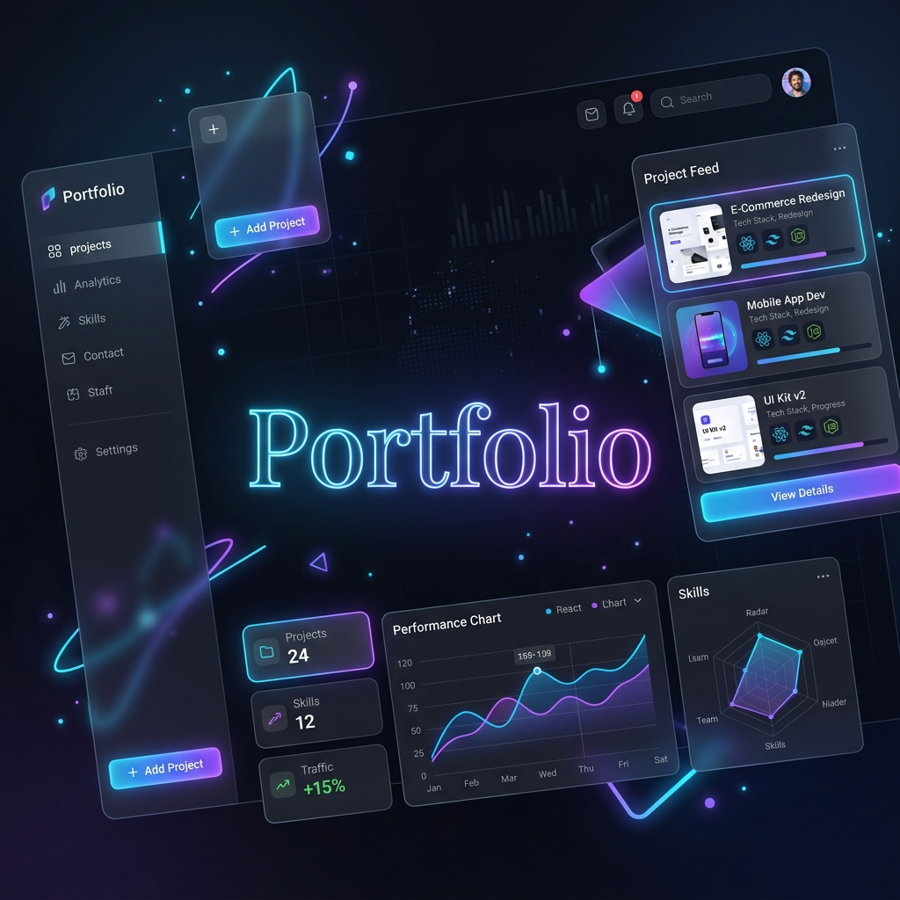

<h1 align="center">Vishnu Vardhan Naidu — Portfolio</h1>

<p align="center">
  A single-page portfolio & digital business card, carefully crafted for an ML / GenAI Engineer fresher profile. <br>
  Built with <b>Pure HTML, CSS, and JS</b> — no build step, no framework, just lightning-fast performance and clean aesthetics. ✨
</p>

<div align="center">
  
</div>
<br/>

<div align="center">

  [](https://app.netlify.com/sites/your-site-name/deploys)
  [](https://opensource.org/licenses/MIT)
  [](https://developer.mozilla.org/en-US/docs/Glossary/HTML5)
  [](https://developer.mozilla.org/en-US/docs/Web/CSS)
  [](https://developer.mozilla.org/en-US/docs/Web/JavaScript)

</div>

<hr />

## 🌟 Key Features

- 🌗 **True Dark Mode:** Seamless toggle with a glowing sun/moon animation that respects your system preference and remembers your choice.
- 🎨 **Modern Aesthetics:** Vibrant gradients (Purple → Blue → Cyan), glassmorphism effects, and soft glowing elements.
- 🚀 **Nexus Card Integration:** A standalone, shareable digital business card (`nexus-card.html`) with an interactive 3D tilt-on-hover effect.
- 📱 **Fully Responsive:** Flawless experience from a 390px phone to a 1440px ultrawide, with specialized iOS/Safari fixes.
- ⚛️ **Live Skill Orbit:** Profile photo encircled by floating tech-stack icons that elegantly orbit around the hero section.

---

## 🛠 Tech Stack

<div align="center">
  <a href="https://skillicons.dev">
    
  </a>
</div>

---

## 📂 Project Structure

```bash
vishnu-portfolio-2026/
├── index.html              # 🌐 Main portfolio page
├── nexus-card.html         # 📇 Standalone shareable digital business card
├── style.css               # 💅 Design system, layout, animations, theming
├── script.js               # ⚙️ Typed text, theme toggle, scroll reveal, mobile nav
└── assets/                 # 📦 Static resources
    ├── vishnu_resume.pdf   # 📄 Downloadable résumé
    ├── img/                # 🖼️ Images (Profile & Logos)
    └── projects/           # 💻 Project screenshots (MultiAgent, SolarNet, etc.)
```

---

## 🎨 Customizing & Editing Content

Ready to make it yours? It's easy!

1. 📝 **Text & Content**: Open `index.html` — everything is neatly commented.
2. 🖌️ **Colors & Theme**: Jump into `style.css` and tweak the CSS variables under `:root` (Light Mode) and `html[data-theme="dark"]` (Dark Mode).
3. 🔗 **Project Links**: Search for `View source ↗` in `index.html` and replace with your actual repository URLs.
4. 📇 **Nexus Card**: Edit the `.links` section directly inside `nexus-card.html`.

---

## 🚀 Deployment

Deploying is literally drag-and-drop:

- Just drag this folder into [Netlify Drop](https://app.netlify.com/drop) or link your GitHub repo to Vercel/Netlify.
- `index.html` is your main entry point.
- **Pro Tip:** Share `your-site.com/nexus-card.html` directly as your digital business card on LinkedIn, Linktree, or email signatures!

---

<div align="center">
  
</div>

<p align="center">
  <i>Developed with ❤️ by Vishnu Vardhan Naidu</i>
</p>
